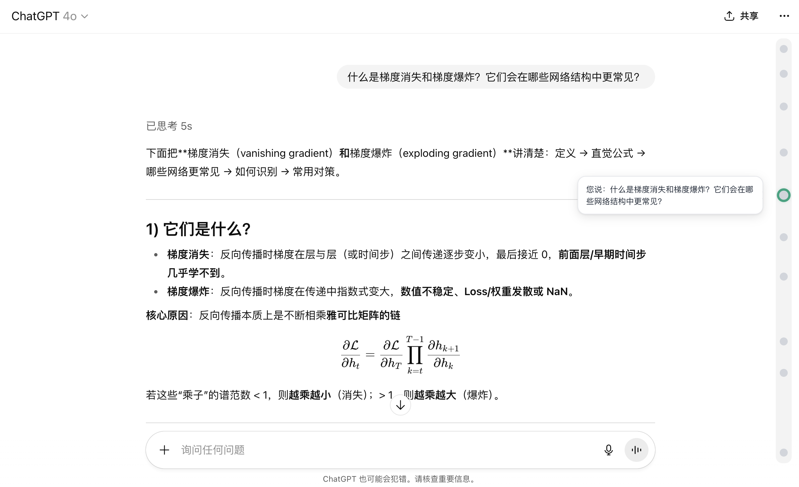

  

# 🕰 ChatGPT Conversation Timeline Extension

> 🇨🇳 查看中文版：[README.zh-CN.md](./README.zh-CN.md)

This extension adds an interactive timeline bar to your ChatGPT conversation pages, helping you quickly understand the structure of the dialogue and jump to any message with a single click.

---

## ✨ Features

- 📍 Clickable markers for each user message  
- 🧭 Instantly jump to any point in the conversation  
- ⭐ Long-press a message to star it, and see it highlighted on the timeline (stars are saved in localStorage, so they persist even after refresh)  
- 🌗 Auto-adapts to ChatGPT's light/dark theme  

---

## 🧩 How to Install (Chrome / Edge)

1. Download this repository and locate the `extension/` folder (contains `manifest.json`, `content.js`, `styles.css`)
2. In your browser, go to: `chrome://extensions/`
3. Enable “Developer Mode” (top right)
4. Click **“Load unpacked”**
5. Select the `extension/` folder to install

> After installation, open any ChatGPT conversation and the timeline will appear on the right.

## 🧩 How to Install (For Firefox Browser)

1. Download this project and locate the chatgpt-timeline.xpi file
2. Open the Firefox browser and go to: about:debugging
3. Click on the "This Firefox" tab
4. Click "Load Temporary Add-on..."
5. Select the chatgpt-timeline.xpi file from the project to load it

> After installation, open any ChatGPT conversation and the timeline will appear on the right.

## 🙏 Acknowledgement

Inspired by the clean and efficient timeline navigation interface from **Google AI Studio**.  
We aim to bring the same intuitive experience to ChatGPT users.

---

## 📄 License

This project is open-sourced under the [MIT License](LICENSE).  