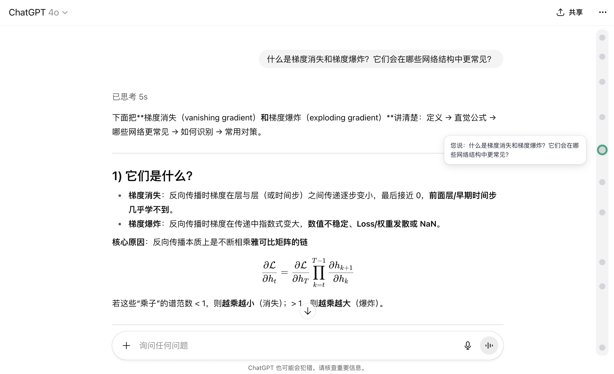

  

# 🕰 ChatGPT Conversation Timeline Extension

> 🇨🇳 查看中文版：[README.zh-CN.md](./README.zh-CN.md)

An extension that adds an interactive timeline to your AI chat conversations. **Now supports ChatGPT, DeepSeek, Microsoft Copilot, and Google Gemini!**

This extension adds an interactive timeline bar to your conversation pages, helping you quickly understand the structure of the dialogue and jump to any message with a single click.

---

## ✨ Features

- **🌐 Multi-Platform Support**: Works seamlessly on **ChatGPT**, **DeepSeek**, **Microsoft Copilot**, and **Google Gemini**.
- **📍 Clickable Markers**: Instantly jump to any point in the conversation via clickable markers for each user message.
- **⭐ Star Messages**: Long-press a message to star it, and see it highlighted on the timeline. Stars are saved locally and persist across sessions.
- **🌗 Auto-Theming**: Automatically adapts to the light/dark theme of each platform.
- **⚙️ Full Control**: A simple popup menu allows you to enable or disable the timeline globally or for each site individually.

---

## 🧩 How to Install (Chrome / Edge)

### ✅ Recommended: Install from Chrome Web Store

👉 [Install from Chrome Web Store](https://chromewebstore.google.com/detail/ickndngbbabdllekmflaaogkpmnloalg?utm_source=item-share-cb)

---

### 🛠 Manual Installation (Get new features faster)

This method allows you to use the latest version immediately, without waiting for the Chrome Web Store review process.

1. Download this repository and locate the `extension/` folder.
2. In your browser, go to: `chrome://extensions/`
3. Enable “Developer Mode” (top right).
4. Click **“Load unpacked”**.
5. Select the `extension/` folder to install.

> After installation, open any ChatGPT, DeepSeek, Copilot, or Gemini conversation and the timeline will appear on the right.

## 🙏 Acknowledgement

Inspired by the clean and efficient timeline navigation interface from **Google AI Studio**.  
We aim to bring the same intuitive experience to more AI chat platforms.

---

## 📄 License

This project is open-sourced under the [MIT License](LICENSE).